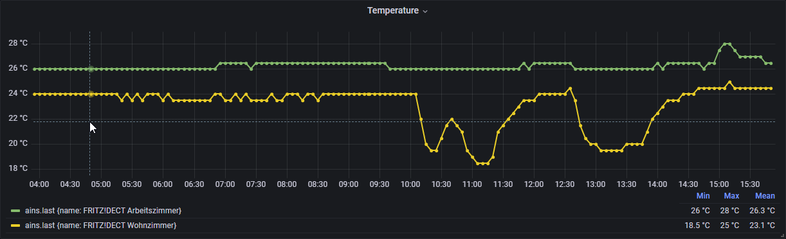

# fritzboxActors2InfluxDB

[](http://perso.crans.org/besson/LICENSE.html)
[](https://img.shields.io/badge/os-Linux-green)
[](https://img.shields.io/badge/Python-3.10%2B-blue)
[](https://img.shields.io/badge/InfluxDB-1.8-orange)
[](https://img.shields.io/badge/InfluxDB-2-orange)


## What is it?

This is my attempt to create a Python script that reads temperature and energy data from AVM's (Fritz!) Smart Plugs (== power switches) FRITZ!DECT 200 (see https://en.avm.de/products/fritzdect/fritzdect-200/).

The main script **app.py** is to be called periodically via cron or a similar technique. It will retrieve 
* the AIN (actor identification number?)
* the name of the actor (as given in the Fritz!Box configuration page for smart home devices)
* the state (switched on/off) of the actor
* the current temperature
* the current power consumption in mW
* the overall engery consumption in Wh since initialization or last reset of that actor
* the current timestamp in UTC timezone

It will then store these values in an [InfluxDB](https://www.influxdata.com) in a measurement named _ains_. From there they may visualized in applications such as [Grafana](https://grafana.com) (see grafana/panel_temperatures.json) for an example panel; the JSON code can be copied into the panel json field in Grafana).



## Disclaimer

I am not a professional programmer (any more), thus this code will most probably not live up to current standards. Still I tried to write clean code and tried to comment the most important parts to make it easier to understand. Feel free to comment and when possible, I will try to improve it in the future.

**I will take no responsibility whatsoever for any damage that may result by using this code.**

## How it works

### Requirements

* Python 3.10 or higher (may work below 3.10)
* additional Python modules: see requirements.txt
* Influx DB 1.8 or 2+ reachable from your network 
* (Grafana for visualization)

### Installation

1. Clone the git repository from https://github.com/LordOfTheSnow/fritzboxActors2InfluxDB.git 
2. Change to the created directory
3. Create a Python virtual environment with `python3 -m venv venv`
4. Activate that virtual environment with `source venv/bin/activate`
5. Install the required Python modules via pip: `pip install -r requirements.txt`
6. Create a file _.env_ and put in the configuration values

### Updating from V1
1. Delete your whole virtual environment you created in step 3 of the installation process
2. Create a new Python virtual environment with `python3 -m venv venv`
3. Activate that virtual environment with `source venv/bin/activate`
4. Install the required Python modules via pip: `pip install -r requirements.txt`
5. The configuration values for InfluxDB 1.8 have changed slightly, see _Configuration values_


### Configuration values (.env)

There are various methods in InfluxDB 2 to read configuration values. I decided to stick with the .env file file because it is also possible to set the config values for InfluxDB 2 via environment variables and they will still be read with by the dotenv-python package - so it's up to you if you set those values in the .env file or as enviroment variables.

The configuration values for accessing the FritzBox and InfluxDB 1.8 must be set in the .env file, they are **not* read from the environment. **Note the slight changes for release V2 of _fritzboxActors2InfluxDB_ below!**

* loglevel = logging.INFO - set to one of the values listed under https://docs.python.org/3/library/logging.html#levels
* logfilename = "fritz.log" - choose whatever filename you like

* fritzUrl = "http://fritz.box/" - note the trailing slash!
* fritzUser = "USER WITH SMART HOME RIGHTS"
* fritzPassword = "PASSWORD OF THAT USER"

* {**new in V2**} influxVersion = "2" - decides whether to use InfluxDB 1.8 (=="1") or InfluxDB 2 (=="2", default)

* only for InfluxDB V1.8
  * {**new in V2**} influxUrl = full URL including protocol and port to the InfluxDB server, e.g. `"http://localhost:0886"`
  * {**removed in V2**} ~~influxPort = 8086~~
  * influxDbName = "fritzbox"
  * influxRetentionPolicy = "your retention policy" - if you use your own retention policy here, do provide it here, otherwise comment out the whole line (by adding a hashmark '#' at the beginning of the line)

* only for InfluxDB V2 (these values may be omitted in the .env file and set directly as environment variables)
  * INFLUXDB_V2_URL = "http://localhost:8086"
  * INFLUXDB_V2_ORG = "MyOrg"
  * INFLUXDB_V2_TOKEN = "My Token"
  * INFLUXDB_V2_BUCKET = "fritzbox"

The InfluxDB server and the database or bucket ("fritzbox" in this example) have to exist already. I used the following influx command to create the InfluxDB V1.8:

`create database fritzbox with duration 365d replication 1 shard duration 7d name one_year`

Use shorter values for the _duration_ and _shard duration_ if you want to. (The _duration_ values will determine how long the data will be stored until it will be automatically removed.)

If you use InfluxDB 2, use the Influx GUI to set up your organzination, bucket and token.


### Usage 

#### Run from shell

7. From within the virtual environment, call the script with `python app.py`.

The script will output the current values for the smart plugs that it finds and will also write them into the configured Influx database.


#### Run via periodically via cron

If you want to run this script periodically via cron, you can call the wrapper script `cronscript.sh`. Rename the provided `cronscript.sh.example` to `cronscript.sh` to ensure your script does not get overwritten if new versions will be in the repository.

7. Set execute permissions for the script: `chmod ug+x cronscript.sh`
8. Call `crontab -e` to edit the cron table (crontab), e.g.: 

```
# m h  dom mon dow   command
*/5 * * * * /home/pi/src/fritzboxActors2InfluxDB/cronscript.sh
```
This will run the command every five minutes. Edit the path to the script to wherever you put it. 
The script assumes you have a Python virtual environment created with `python3 -m venv venv` in the same directory where you checked out the repository. The script will activate the virtual environment, call the Python interpreter with the script and will deactivate the virtual environment then.


### Main subroutine

The script to run is **app.py**. All other files just contain helper functions or class definitions.

The script expects various config values in a file called **.env** (See above. An example file has been provided in this repository. Rename to `.env` and then edit the values according to your own needs).


### Files and data created

1. ./fritz.log - Logfile (file name and log level can be changed in _.env._, see above)

This program does output (some) error messages on the console and into the logfile. Set the loglevel to `level=logging.DEBUG` to get more infos.

**WARNING: No log rotation has been implemented yet, so expect a large log file if you do not turn off DEBUG level!**

2. measurement _ains_ in the Influx DB configured under _influxDbName_ or _influxBucket_ respectively

```
    {
        "measurement": "ains",
        "tags": {
            "ain": fritzActor.ain,
            "name": fritzActor.name
        },
        "fields": {
            "temperature": fritzActor.temp,
            "power": fritzActor.power,
            "energy": fritzActor.energy
            "state": fritzActor.state
        },
        "time": fritzActor.timestamp
    }
```

## Known bugs & limitations

* Database authentiction (InfluxDB 1.8) is not supported and will most probably not be done in the future as InfluxDB 1.8 is going to get outdated
* If you grouped your actors in the Fritzbox, this script will most probably fail as groups are found additionally to the individual actors. This may be corrected in the future.
* Log rotation for _./fritz.log_ has not been implemented yet. See hint above!

## Additional documentation used (German)

* https://avm.de/fileadmin/user_upload/Global/Service/Schnittstellen/AHA-HTTP-Interface.pdf
* https://avm.de/fileadmin/user_upload/Global/Service/Schnittstellen/AVM_Technical_Note_-_Session_ID.pdf

## History

* 23-Jul-2022: Release 2.0, you can now choose if you want to use an InfluxDB 1.8 or 2 
* 03-Sep-2021: fixed #1 incorrect timestamp - https://github.com/LordOfTheSnow/fritzboxActors2InfluxDB/issues/1#issue-986195302
